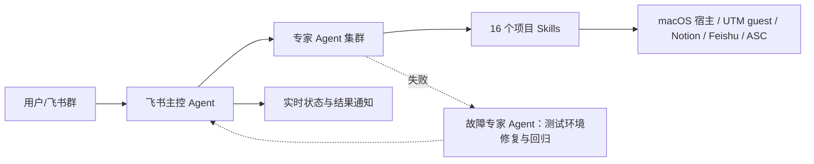
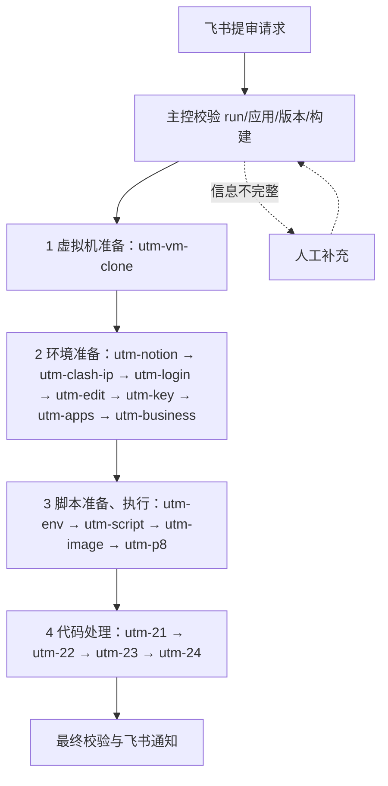
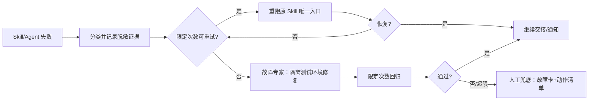

# macOS 提审自动化 · v3.0

 

这是从 macOS 宿主协调 UTM macOS guest、Feishu OpenAPI、Notion API 与 App Store Connect 的提审自动化项目。v3.0 以**飞书机器人作为主控 Agent**，统一调度多个专家 Agent；固定流程由项目内 16 个 Skills（含 Playwright 自动化能力）封装，按需调用并保留可复核证据。

> 当前公开版本先固化架构、Agent 注册表、提示词、交接协议与故障闭环；飞书提审启动仍保持禁用，不把设计能力描述为已经开启的线上自动调度。

## 架构图



主控负责请求校验、编排、汇总和通知；专家负责清晰边界的阶段；Skills 是唯一执行正文源。生图专家专门生产 **app 截图、金币图、研发截图**；故障专家负责“重试 → 自愈 → 人工”；App 应用 A 面代码由独立专家负责。

## 提审流程图



## 故障闭环图



## 四段顺序与技能

1. 虚拟机准备：utm-vm-clone
2. 环境准备：utm-notion → utm-clash-ip → utm-login → utm-edit → utm-key → utm-apps → utm-business
3. 脚本准备、执行：utm-env → utm-script → utm-image → utm-p8
4. 代码处理：utm-21 → utm-22 → utm-23 → utm-24

每段可单独运行，每个技能可人工单独指定执行；只运行用户指定范围，范围内保持精确顺序。图片中可能写作 utm-clash，当前仓库真实技能名是 **`utm-clash-ip`**，不新增虚构技能目录。

完整技能链接：[`utm-vm-clone`](skills/utm-vm-clone/SKILL.md)、[`utm-notion`](skills/utm-notion/SKILL.md)、[`utm-clash-ip`](skills/utm-clash-ip/SKILL.md)、[`utm-login`](skills/utm-login/SKILL.md)、[`utm-edit`](skills/utm-edit/SKILL.md)、[`utm-key`](skills/utm-key/SKILL.md)、[`utm-apps`](skills/utm-apps/SKILL.md)、[`utm-business`](skills/utm-business/SKILL.md)、[`utm-env`](skills/utm-env/SKILL.md)、[`utm-script`](skills/utm-script/SKILL.md)、[`utm-image`](skills/utm-image/SKILL.md)、[`utm-p8`](skills/utm-p8/SKILL.md)、[`utm-21`](skills/utm-21/SKILL.md)、[`utm-22`](skills/utm-22/SKILL.md)、[`utm-23`](skills/utm-23/SKILL.md)、[`utm-24`](skills/utm-24/SKILL.md)。

## Agent 注册表与提示词

机器可读注册表：[`config/agents.json`](config/agents.json)；提示词索引：[`docs/agent-prompts/README.md`](docs/agent-prompts/README.md)。每个 Agent 都有可复制提示词，包含角色、输入输出、权限边界和交接要求；包括飞书主控、提审登记、VM、环境、脚本、生图、P8、App 应用 A 面代码、构建分发、审核准备、最终校验、故障专家。

交接字段固定为：`status / run_id / agent_id / skill_id / evidence / artifacts / next_step`。故障策略固定为：重试失败后进入隔离测试环境修复，修复后回归；超出次数或涉及敏感权限时人工兜底。

## 快速启动

```bash
git clone https://github.com/lbql-yhl/devops-mac.git && cd devops-mac
cp .env.example .env && chmod 600 .env && git check-ignore -q .env
python3 scripts/preflight.py --project-only
/bin/zsh scripts/install_project_skills.sh --install
python3 -u services/feishu_supervisor.py
```

按 [配置参考](docs/configuration.md) 填写当前宿主自己的 token、key、ID、path 和 password；不要复制其他机器的 `.env`。宿主/guest 依赖见 [依赖检查](docs/host-vm-dependency-check.md)，Feishu 部署见 [Bot 指南](docs/utm-feishu-bot.md)。当前飞书提审启动禁用：完整登记消息和 `/提审 开始` 不会创建新 run、VM、prompt 或后台 runner。

## 执行边界与安全

单技能执行以 `skills/<skill>/SKILL.md` 为唯一真值；文档只做索引，不读取或解释脚本内容。Feishu 只通过 Bot/OpenAPI，Notion 只通过 Notion API 和 `scripts/notion_api.py`。严禁提交或输出 `.env`、runtime、签名私钥/证书/profile、VM 包/镜像/配置、真实资源 ID、主机绝对路径或密码。

## 维护检查

```bash
python3 -m pytest -q
python3 -m pytest -q tests/test_v3_agent_registry.py
python3 scripts/public_release_audit.py
git diff --check
```

更多阶段与交接说明见 [项目流程](docs/project-workflow.md)。
